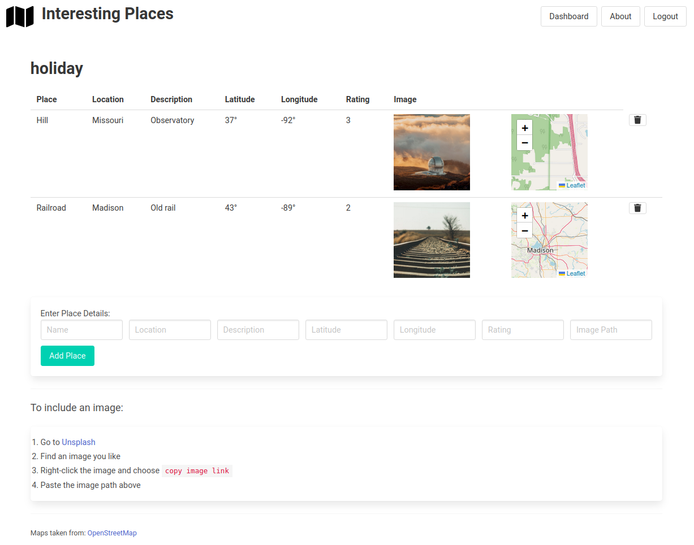
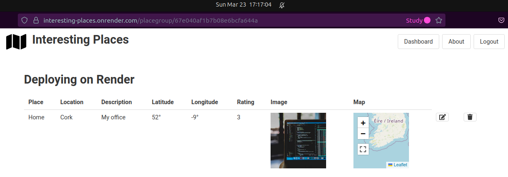
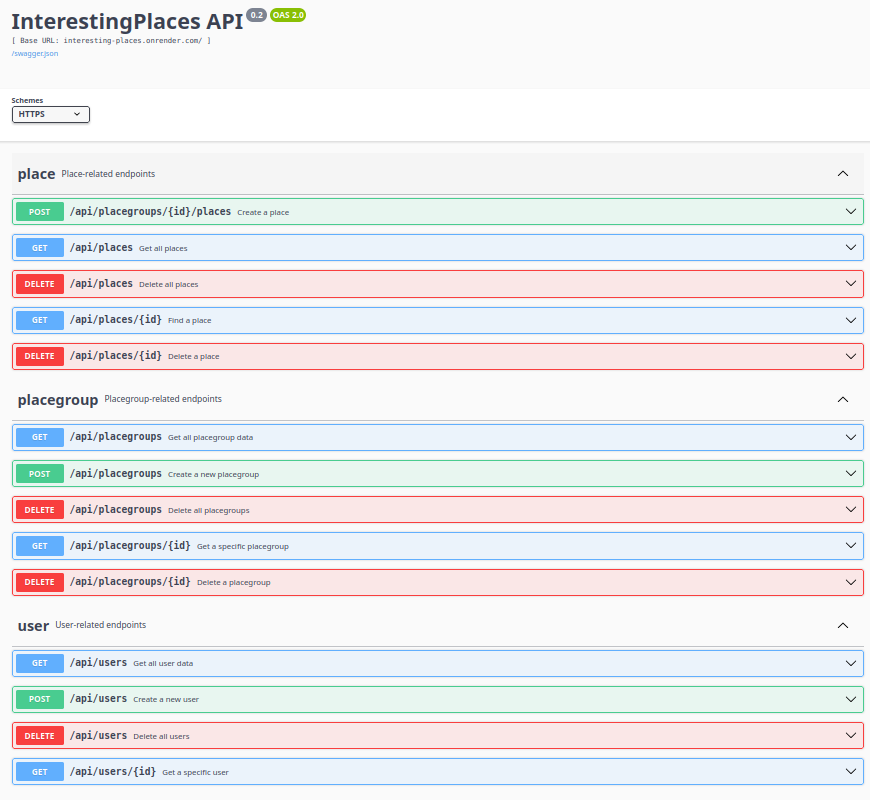

# Interesting Places

A basic CRUD application for points-of-interest,
allowing **experiences** to be recorded using
groups of **interesting places**:

This is how the deployment looks on Render:

This is an example of the Swagger-based, interactive API documentation:

## The basic idea

There is a lot that can be done, but time is short!
Here are some essentials:

* User creates account and logs in
* Creates groups of places
* Places have associated data
* User stores groups in account
* The data is accessible via an API
* The API is documented

## Todo

* [x] Minimal extension to model (e.g., name, description, lat, long, rating)
* [x] Add enhancements (e.g., user images, admin user)
* [x] API docs
* [x] Deploy
* [ ] Structure and complete README
* [ ] Complete rubric

### Standing item

* [ ] Check and update tests

## Bugs

* Invalid place details send user to faulty input screen (404 on input)
* Empty string for lat, long and rating returns 0 (not ideal)
